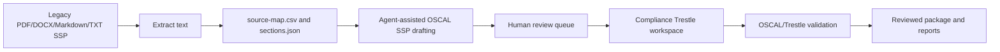

# OSCAL Document Workbench

The OSCAL Document Workbench is the legacy-document-to-OSCAL workflow for this repository.

## Principles

- Source traceability is mandatory.
- Ambiguous mappings remain `needs_review`.
- Compliance Trestle is the operational backbone for OSCAL workspace lifecycle.
- Agent harnesses are adapters, not the core product.
- Schema-valid OSCAL does not prove compliance effectiveness.

## Main artifacts

- `plugins/document-transform/oscal-document-workbench/`
- `agent-skills/oscal-document-engineering/`
- `agent-skills/compliance-trestle-engineering/`
- `adapters/generic-agent-package/`
- `examples/legacy-ssp-to-oscal/`
