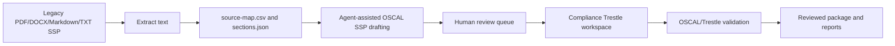

# OSCAL Document Workbench

The OSCAL Document Workbench is the legacy-document-to-OSCAL workflow for this repository.
The core product is OSCAL plus Compliance Trestle.
FedRAMP Rev 5 heading maps and FedRAMP 20x KSI coverage are optional adapters.

## Principles

- Source traceability is mandatory.
- Ambiguous mappings stay `needs_review`.
- Compliance Trestle is the operational backbone for the OSCAL workspace lifecycle.
- Agent harnesses are adapters.
- Agent harnesses are not the core product.
- Schema-valid OSCAL does not prove compliance effectiveness.

## Main artifacts

- `plugins/document-transform/oscal-document-workbench/`
- `agent-skills/oscal-document-engineering/`
- `agent-skills/compliance-trestle-engineering/`
- `adapters/generic-agent-package/`
- `examples/legacy-ssp-to-oscal/`

## FedRAMP 2026 transition

FedRAMP is moving away from the legacy Rev 5 document templates.
It moves to the machine-readable 2026 Consolidated Rules (`FedRAMP/rules` and `FedRAMP/2026-markdown` on GitHub).
The workbench handles both:

- Legacy documents (Rev 5 SSP templates, Appendix A, and older SSPs) convert into OSCAL through extraction and `draft-ssp-from-extraction.sh`.
- `fetch-fedramp-2026-rules.sh` downloads the Consolidated Rules (FRD, FRR, KSI, and CTL data).
- `ksi-coverage-report.sh` compares an OSCAL SSP to the 46 FedRAMP 20x Key Security Indicators.
- The report shows which KSIs have documented control coverage.

KSI coverage is documentation evidence only.
FedRAMP 20x validates KSIs through assessment and telemetry.
It does not validate KSIs through narrative documents only.

## Validation layers

`validate-oscal-package.sh` runs each validator that it can find.
It records which validators ran in `validation-report.json`:

- `trestle validate` checks Trestle workspace and model integrity.
- `oscal-cli validate` (when installed) checks OSCAL JSON against the official NIST schemas.
- Constraint validation is disabled because Trestle-internal `trestle://` import references are not resolvable outside a Trestle workspace.

Report status is `pass` when all available validators succeed.
Report status is `partial` when a validator is missing.
Report status is `fail` when any validator finds a structural problem.
