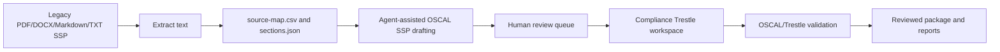

# OSCAL Document Workbench

The OSCAL Document Workbench is the legacy-document-to-OSCAL workflow for this repository.

## Principles

- Source traceability is mandatory.
- Ambiguous mappings remain `needs_review`.
- Compliance Trestle is the operational backbone for OSCAL workspace lifecycle.
- Agent harnesses are adapters, not the core product.
- Schema-valid OSCAL does not prove compliance effectiveness.

## Main artifacts

- `plugins/document-transform/oscal-document-workbench/`
- `agent-skills/oscal-document-engineering/`
- `agent-skills/compliance-trestle-engineering/`
- `adapters/generic-agent-package/`
- `examples/legacy-ssp-to-oscal/`

## FedRAMP 2026 transition

FedRAMP is moving away from the legacy Rev 5 document templates toward the machine-readable 2026 Consolidated Rules (`FedRAMP/rules` and `FedRAMP/2026-markdown` on GitHub). The workbench handles both:

- Legacy documents (Rev 5 SSP templates, Appendix A, and older SSPs) convert into OSCAL through extraction and `draft-ssp-from-extraction.sh`.
- `fetch-fedramp-2026-rules.sh` downloads the Consolidated Rules (FRD/FRR/KSI/CTL data).
- `ksi-coverage-report.sh` cross-references an OSCAL SSP against the 46 FedRAMP 20x Key Security Indicators and reports which KSIs have documented control coverage.

KSI coverage is documentation evidence only; FedRAMP 20x validates KSIs through assessment and telemetry, not narrative documents.
